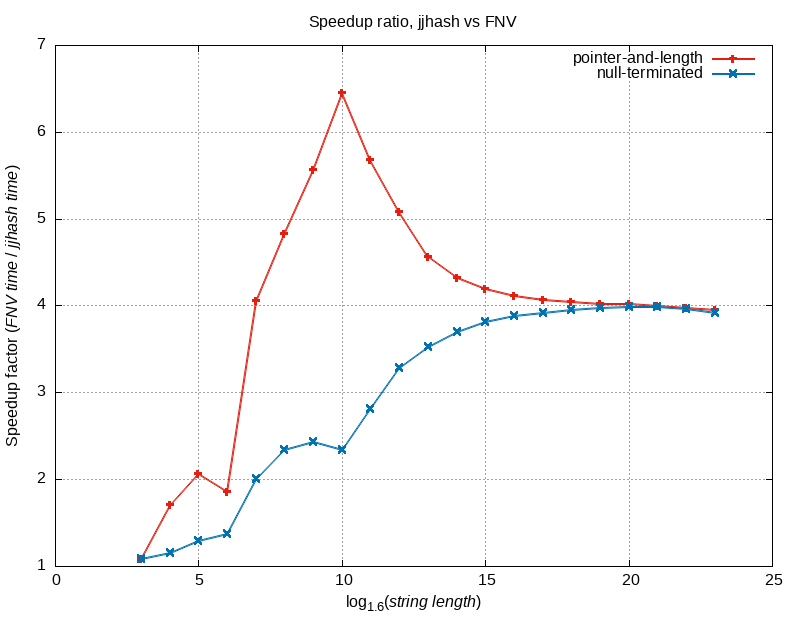
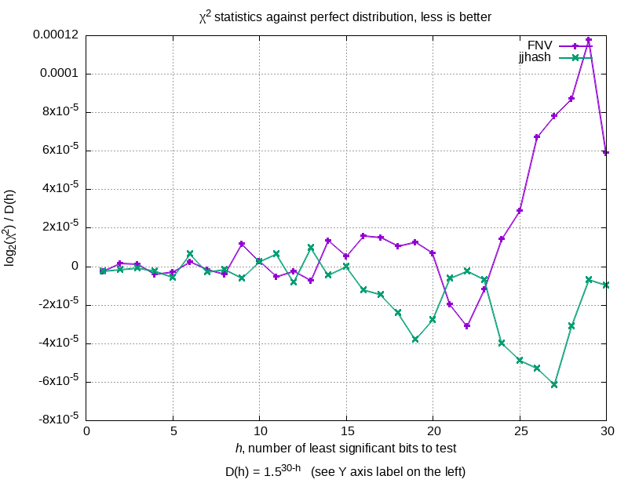

jjhash is a pretty mediocre string hash function.
Here are some reasons why you would want to use it nevertheless:
1. It’s simple, and the implementation is very small and consists of a single header file. If you don't like including some fancy code, the inner workings of which you don’t completely understand, into your project, this might be your thing.
2. It’s faster than FNV-2: 6x faster on pointer-and-length strings, 3x faster on null-terminated strings (see [bench](./bench/) directory).
3. We believe that it is either on par with, or better than, FNV-2 on statistical properties (see [quality](./quality/) directory).
4. It’s streamable, by which we mean `hash(A concatenated with B)` can be calculated in `O(length(B))` if we know `A`’s hashing state (which must be `O(1)` in space) and have access to `A`’s length and content. Note than FNV-2 is also streamable under this definition. See [jjhashx.h](./jjhashx.h) and [jjhash\_64/jjhashx64.h](./jjhash_64/jjhashx64.h).
5. The implementation does not contain any compiler- or platform-dependent code (in particular, checks for endianness), free of any kinds of undefined, implementation-defined and/or unspecified behaviors according to both C and C++ standards, and conforming to C99 and C++98.
6. The hashes are consistent between little-endian and big-endian platforms.
7. It has both 32-bit hash and 64-bit hash variants (see [jjhash\_64](./jjhash_64/) directory for 64-bit version of jjhash).
8. It’s licensed under public domain-like license (Unlicense).

# Definition

jjhash is defined as follows:

```
uint64_t a = JJ_OFFSET;

for each 4-byte chunk of input as 'v' (as little-endian):
    a ^= v;
    a *= JJ_PRIME;

if any bytes of input left:
    v = remaining bytes of input (as little-endian, unused bytes set to zero);
    a ^= v;
    a *= JJ_PRIME;

a ^= a >> 16;
a ^= a >> 8;
return a & MASK;
```

where:
  * `JJ_OFFSET` is 0x100000000;
  * `JJ_PRIME` is 2752750471;
  * `HASH_TYPE` is `uint32_t` for 32-bit hash version and `uint64_t` for 64-bit hash version;
  * `MASK` is `UINT32_MAX` (0xFFFFFFFF)  for 32-bit hash version and `UINT64_MAX` (0xFFFFFFFFFFFFFFFF) for 64-bit hash version.

# Validation

We check the following things:
  1. `jjhash_s` (function to hash a null-terminated string) and `jjhash_b` (function to hash a pointer-and-length string) agree on the hash of the same string;
  2. calculating the hash of concatenation from the previous state and the new string works as expected;
  3. the functions do not make unsafe reads past their data (this may lead to a segmentation fault in a real-world program):
we check it by placing the string just before a “poisoned page” (first we allocate two normal pages with `mmap()`, then poison the second page with `mprotect(..., prot=PROT_NONE)`);
  4. all the properties above are invariant over the alignment of the pointer to the beginning of the string.

See [validate](./validate/) directory for more information.

# Benchmarks

We generate 200 random words of approximately given length `L` (namely, of length `L - random() % 4`),
then measure the time it takes to hash all the generated words `N` times,
where `N = floor(15000000 / L)`.

We perform this measurement:
  1. for various `L`s: namely, of form `L = round_up_4(floor(1.6 ^ i))` for `i=3...23`, where `round_up_4(n) = n + (4 - n % 4) % 4` rounds up its argument to a multiple of 4;
  2. for both jjhash and FNV-2;
  3. for both hashing a null-terminated string and for hashing a pointer-and-length string.

## Results




See [bench](./bench/) directory for more information and instructions on how to reproduce.

# Statistical properties

We use the following χ2 test given in the Dragon Book to evaluate the quality of a given hash function:
```latex
$$
\frac{
    \sum\limits_{j=0}^{m-1} b_j (b_j + 1) / 2
}{
    (n / 2m)(n + 2m - 1)
},$$
```
where `$n$` is the number of words, `$m$` is the number of buckets, `$b_j$` is the number of words in the bucket `$j$`.

Here’s a rendered formula of the above LaTeX code:


We test on the [corpus](http://shdown.github.io/stuff/jjhash/check_quality_corpus.txt.gz) of `W`=146'728 words extracted from the OANC American English language corpus.
To prevent “overfitting”, we chose `JJ_PRIME` from a large set of prime numbers based on the performance on a smaller dictionary of 27k words;
this evaluation is thus a “validation”.

For each `i=1...30`, we downsample the corpus to `min(2^i, W)` words (i.e. choose a random subset of this size) and
map these words into `2^i` buckets with the hash function.
We then calculate the χ2 statistic using the LaTeX formula above.

For illustrative purposes, we then take base-2 logarithm of the result and then divide it by `1.5^(30-i)`.

## Results



See [quality](./quality/) directory for more information and instructions on how to reproduce.

# License

The definition and implementation of jjhash, and the rest of the code in this repo, is licensed under [Unlicense](https://unlicense.org), a public domain-like license.


