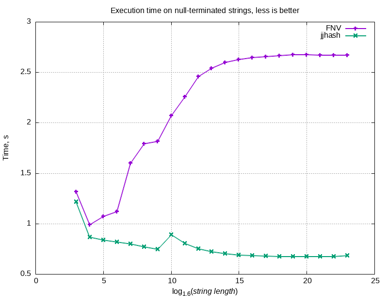

# Description

We generate 200 random words of approximately given length `L` (namely, of length `L - random() % 4`),
then measure the time it takes to hash all the generated words `N` times,
where `N = floor(15000000 / L)`.

We perform this measurement:
  1. for various `L`s: namely, of form `L = round_up_4(floor(1.6 ^ i))` for `i=3...23`, where `round_up_4(n) = n + (4 - n % 4) % 4` rounds up its argument to a multiple of 4;
  2. for both jjhash and FNV-2;
  3. for both hashing a null-terminated string and for hashing a pointer-and-length string.

# Results





# Reproduction

Unlike the hash itself, benchmarking code requires a GNU C-compatible compiler, a somewhat POSIX-compliant OS, and bash.

You can run the benchmark on your machine as follows:
```bash
# Run benchmark for pointer-and-length strings
./bench.sh b | tee RESULTS_b.txt

# Run benchmark for null-terminated strings
./bench.sh s | tee RESULTS_s.txt

# Generate 'graph_rawtimes_b.png'
gnuplot < graph_rawtimes_b.gnuplot

# Generate 'graph_rawtimes_s.png'
gnuplot < graph_rawtimes_s.gnuplot

# Generate 'graph_ratios.png'
gnuplot < graph_ratios.gnuplot
```
