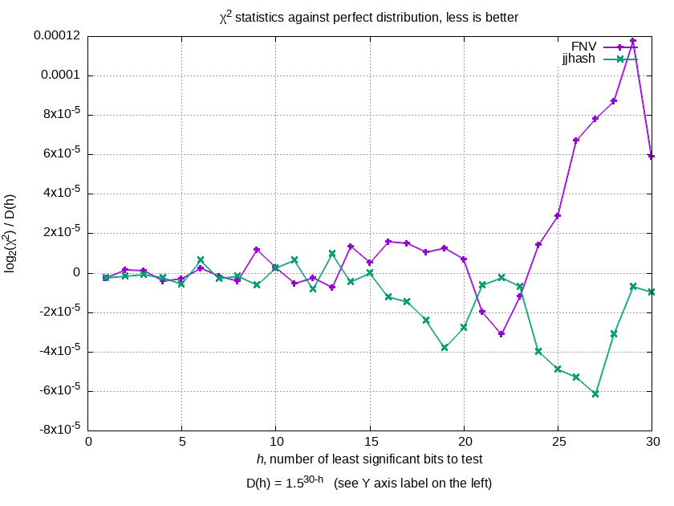

# Description

We use the following χ² (chi-squared) test given in the Dragon Book to evaluate the quality of a given hash function:
```latex
$$
\frac{
    \sum\limits_{j=0}^{m-1} b_j (b_j + 1) / 2
}{
    (n / 2m)(n + 2m - 1)
},$$
```
where `$n$` is the number of words, `$m$` is the number of buckets, `$b_j$` is the number of words in the bucket `$j$`.

Here’s a rendered formula of the above LaTeX code:


We test on the [corpus](http://shdown.github.io/stuff/jjhash/check_quality_corpus.txt.gz) of `W`=146'728 words extracted from the OANC American English language corpus.
To prevent “overfitting”, we chose `JJ_PRIME` from a large set of prime numbers based on the performance on a smaller dictionary of 27k words;
this evaluation is thus a “validation”.

For each `i=1...30`, we downsample the corpus to `min(2^i, W)` words (i.e. choose a random subset of this size) and
map these words into `2^i` buckets with the hash function.
We then calculate the χ² statistic using the LaTeX formula above.

For illustrative purposes, we then take base-2 logarithm of the result and then divide it by `1.5^(30-i)`.

# Results



# Reproduction

Unlike the hash itself, quality evaluation code requires a GNU C-compatible compiler, a somewhat POSIX-compliant OS, and bash.

You can reproduce our results as follows:

```bash
# Compile evalqual
gcc -Wall -Wextra -O3 evalqual.c ../utils/*.c -lm -o evalqual

# Download and unpack the corpus (1.3 MB uncompressed)
wget -O- http://shdown.github.io/stuff/jjhash/check_quality_corpus.txt.gz | gzip -d > words.txt

# We want to evaluate quality only for the single JJ prime
echo 2752750471 > primes.txt

# Run evalqual
./evalqual words.txt primes.txt | tee data_raw.txt

# Process the raw data (generates files 'graph_data_fnv.txt' and 'graph_data_jj.txt')
./process.sh data_raw.txt

# Make the plot (generates file 'graph.png')
gnuplot < graph.gnuplot
```
